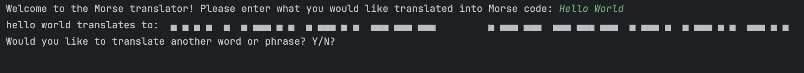

# 🔡 Text to Morse Code Converter

A simple Python program that converts plain English text into Morse code. Great for learning basic encoding or just for fun!

---



---

## 📦 Features

- 🔠 Converts letters, numbers, and common punctuation to Morse code
- 💬 Accepts user input via terminal
- 📄 Outputs clean, spaced Morse code
- 🧼 Handles unsupported characters gracefully

---

## 🛠️ Built With

- Python 3
- Standard library only (no external packages)

---

## ▶️ Getting Started

### 1. Clone the Repository

```bash
git clone https://github.com/EricKenji/text-to-morse.git
cd text-to-morse